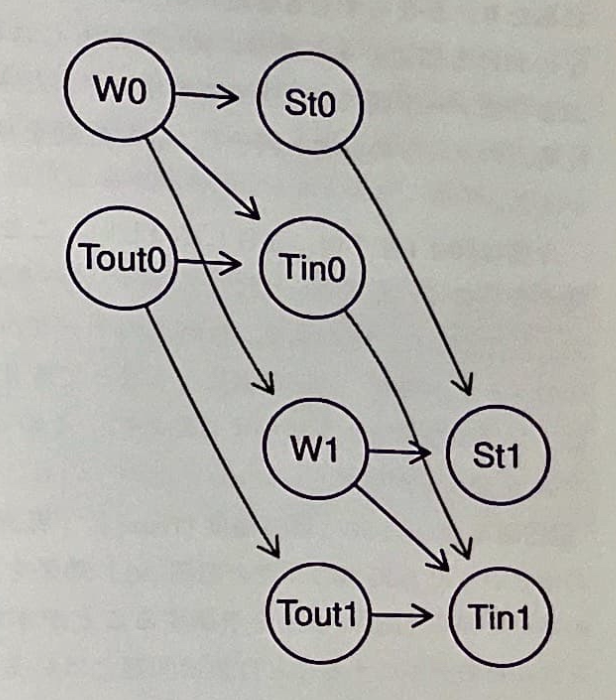
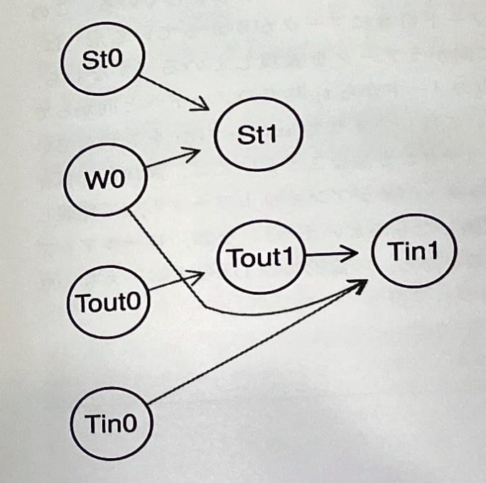
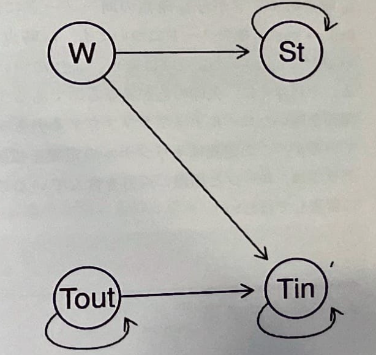

# 時系列データ：ダイナミック・ベイジアンネットワーク

本章以前のベイジアンネットワークをDBNに拡張する

## 事例紹介：ドモティクス(domotics)

民家で屋外の条件に応じて窓を開閉するためのマイクロコントローラのついたパッシブ換気（ただの窓の開け閉める）を設置して空気の質を保つ

センサーによって10分ごとに環境状況を測定できる

10分ごとの屋内の空気の質を予測し、屋内の新鮮な空気や快適な温度を保つために窓を開閉することを考える

## グラフィカル表現

| 項目         | 略称 | 説明     |
|--------------|------|----------|
| 風通しの悪さ | St   |          |
| 屋内温度     | Tin  |          |
| 屋外温度     | Tout |          |
| 窓の開閉     | W    | 二値変数 |

### 静的DAG

```{r}
#時間情報を取り除いた静的DAG
dag <- model2network("[W][Tout][Tin|W:Tout][St|W]")
graphviz.plot(dag)
```

### ナイーブDAG

{width="176"}

-   ある時点での値(t1)はそれに対応した10分前の値(t0)に依存する

-   静的DAGをコピーして変数t0とt1をリンクさせる

-   3つの仮定が含まれる

    -   ノード間における依存構造はt0とt1で同じ

    -   t1はt0に依存しているがその時点より前の変数には依存していない

    -   t0とt1はその時点での瞬間ではなく、ある期間にわたっての平均値

-   限界

    -   t0にかかるノードの周辺分布はt1周辺分布と等しい必要はない

    -   パラメータ数が非常に多くなるため、推定時に安定しない

    -   t0のノードがt1のノードと同一でt0とt1をリンクしたモデルのほうが望ましい

### より倹約的なDAG

{width="201"}

-   t0のモデリングは無視してそれらを固定して扱う

-   ノードW1も除外している

    -   t0時点の窓の開閉がt1時点のTin/Tout/Stいどのように影響するかの、t0時点のWの効果を検討することが目的であるから

### ロールアップグラフ

{width="212"}

-   t0からt1への同一ノードへ向かうアークを示す

-   ループと循環の両方を含むのでDAGとは言えない

## 確率的表現

局所分布を扱うことができる

これまでの離散型、ガウシアン、CCBNなどをダイナミック・ベイジアンネットワークに適応することが可能

簡単にするため離散型ベイジアンネットワークを用いる

```{r}
T.lv <- c("<18", "18-24", ">24")
Tout0.prob <- array(c(0.20, 0.70, 0.10), dim = 3,
                    dimnames = list(Tout0 = T.lv))
#屋外の気温はそんなに変わらないので80%の確率でt0と同じ
Tout1.prob <- array(c(0.80, 0.19, 0.01, 0.10, 0.80, 0.10, 0.01, 0.19, 0.80),
                    dim = c(3, 3),
                    dimnames = list(Tout1 = T.lv, Tout0 = T.lv))
Tout1.prob
```

```{r}
W.lv <- c("open", "closed")
W0.prob <- array(c(0.5, 0.5), dim = 2, dimnames = list(W0 = W.lv))
W0.prob
```
